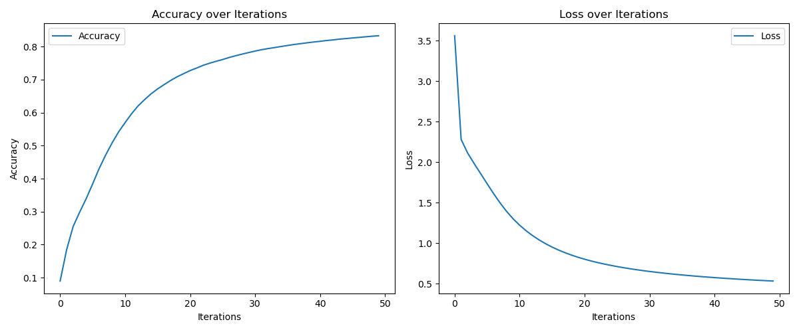

# MNIST Digit Recognizer

This project is a simple neural network built from scratch to recognize handwritten digits from the MNIST dataset. The model is implemented using only NumPy and focuses on understanding the fundamentals of neural networks.

## Project Structure

- `data/`: Contains the dataset used for training and testing.
- `notebooks/`: Jupyter notebook with the main implementation and experiments.
- `scripts/`: Python scripts for training and utility functions.
- `models/`: Directory to save trained model parameters.
- `results/`: Contains results such as plots of training performance.

## Installation

1. Clone the repository:
    ```sh
    git clone https://github.com/Rikhil-Nell/MNIST_digit_reader.git
    cd MNIST_digit_reader
    ```

2. Set up a virtual environment and install dependencies:
    ```sh
    python -m venv venv
    source venv/bin/activate  # On Windows use `venv\Scripts\activate`
    pip install -r requirements.txt
    ```

## Usage

1. Open the Jupyter notebook:
    ```sh
    jupyter notebook notebooks/mnist-digit-reader.ipynb
    ```

2. Run the cells to train the model and visualize the results.

## Results

Here is an example of the accuracy and loss curves over training iterations:



## Future Work

- Implement additional layers and experiment with different architectures.
- Add more sophisticated data preprocessing and augmentation techniques.
- Explore hyperparameter tuning to improve model performance.

